# 健身房管理系统

本系统是基于B/S架构，使用Java编程语言，后台数据库采用MySQL数据库。系统角色有：管理人员，会员，教练。主要功能包括：

（1）工作人员管理

工作人员信息管理，登录管理。

（2）健身会员管理

会员信息管理：会员登录/注册对基本信息增删查改。会员生日提醒，到期提醒。

会员卡管理：充值、续卡、禁用、取消禁用、转卡型、退卡。 

（3）健身私教管理

购买私教课：会员可查询浏览课程信息按课时购买私教课，同时支持设定上课教练的绑定。

预约上课：教练通过系统预约会员或会员登录过系统预约教练

课后签到：教练和会员对已预约的课程进行签到，学员可对本次课程及教练进行评价

课程管理：教练及管理人员可实时查询当前会员购买的课程数、剩余课程数、约课信息、签课信息等。

（4）健身操课管理—-课程管理

操课课程表：管理人员发布操课课程表，会员可登录查看
操课设置：管理人员可添加设置团操教室、团操上课教练、操课类型等
操课预约：会员通过系统预约操课

（5）数据报表管理

销售业绩报表：根据会员卡销售业绩生成报表查看每日销售情况汇总

售课及上课业绩报表：根据私教卖课，及教练上课业绩生成报表并查看每日业绩

工作人员评价报表：根据会员每次课程后对教练和课程的评价汇总生成报表，工作人员可登录查看自己的评价报表

会员特征数据报表：根据每次课程后会员的各项身体特征数据生成报表，教练基于会员的特征数据报表对会员的各项指标进行分析，提供合理的健身意见和课程建议，定期发送给会员。

## 数据库文件已提供，其他问题请加QQ：641351484

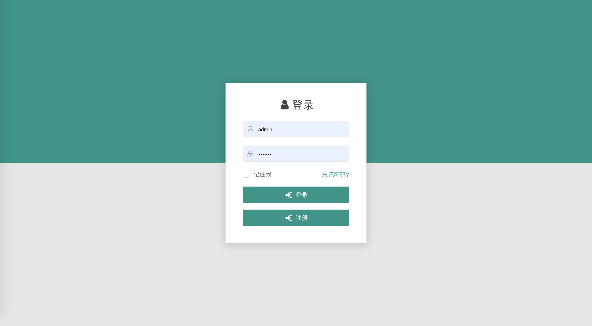

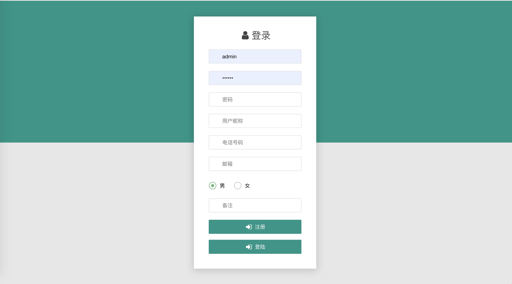

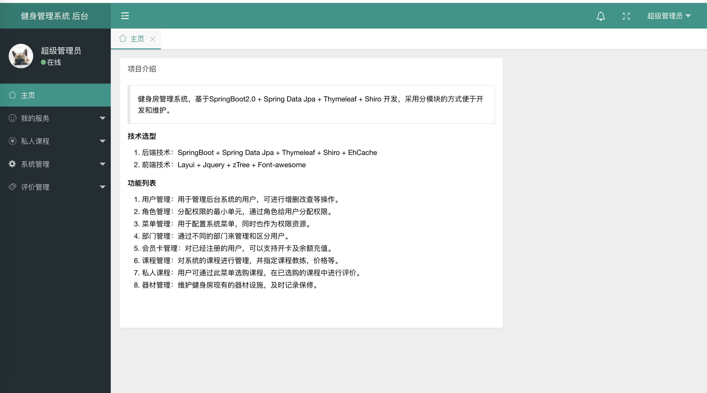

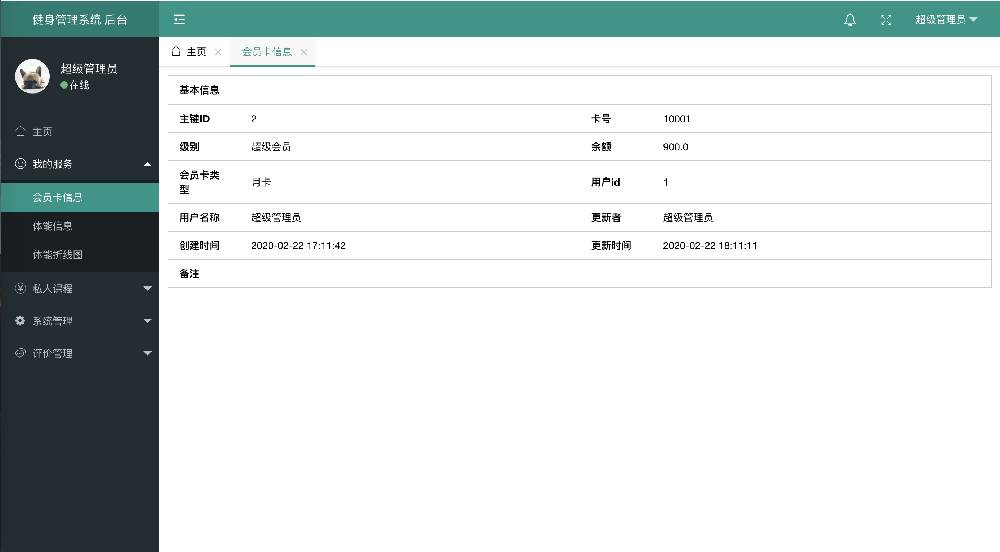

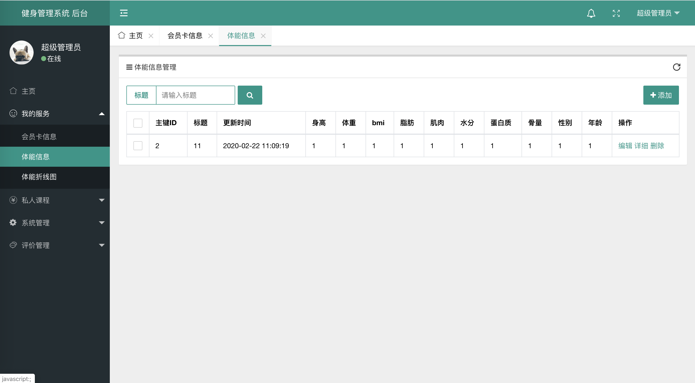

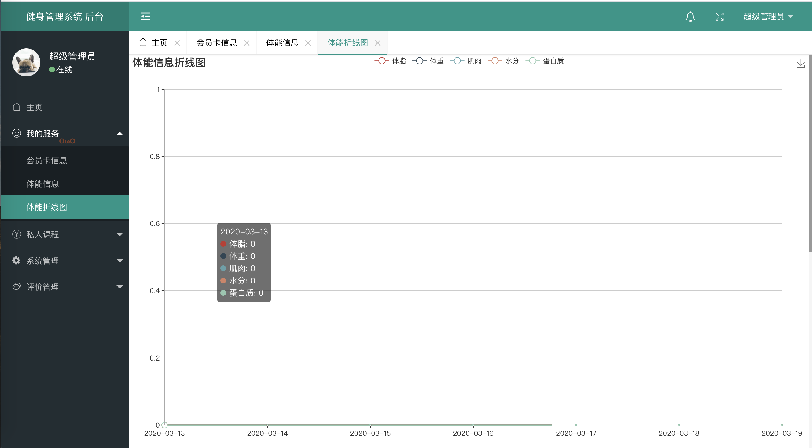

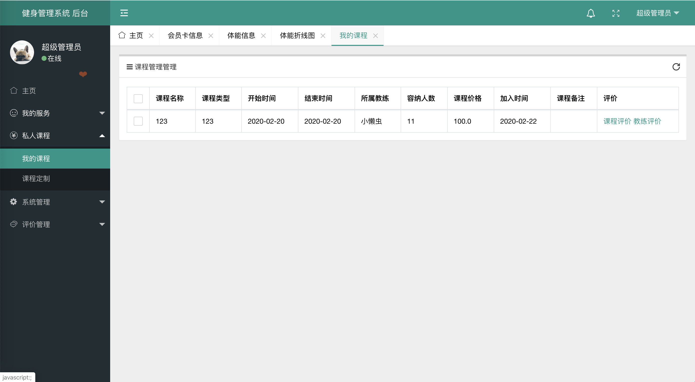

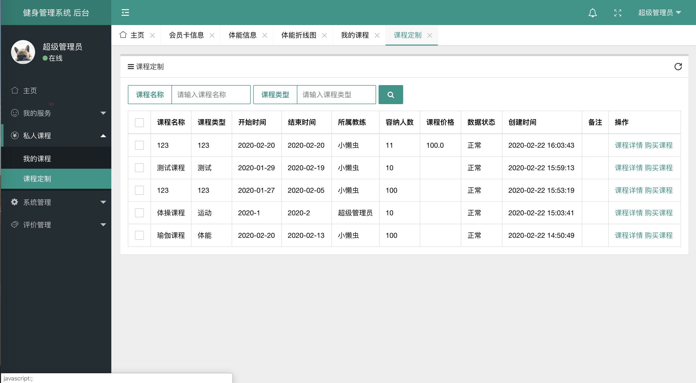

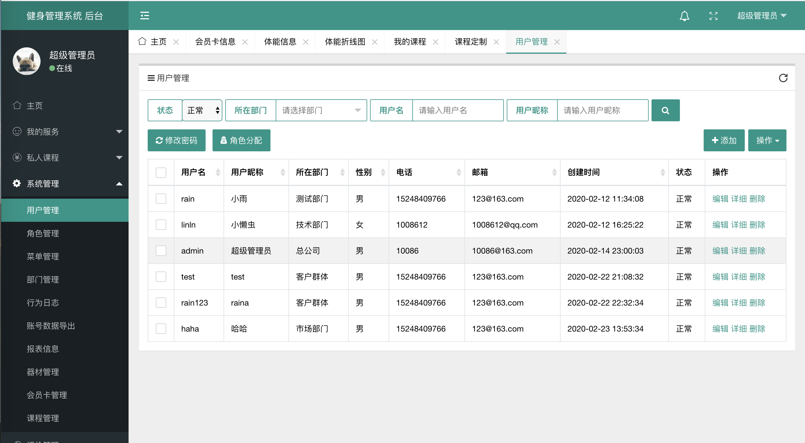

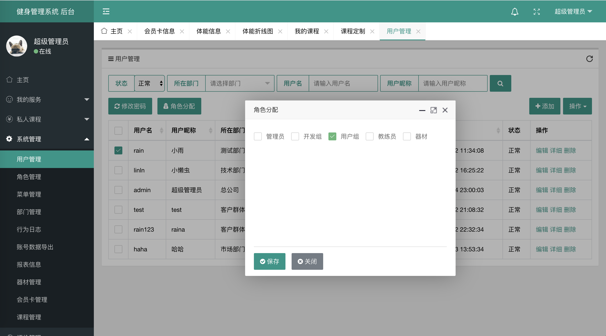

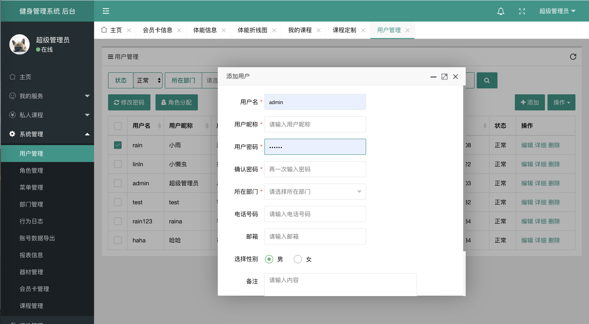

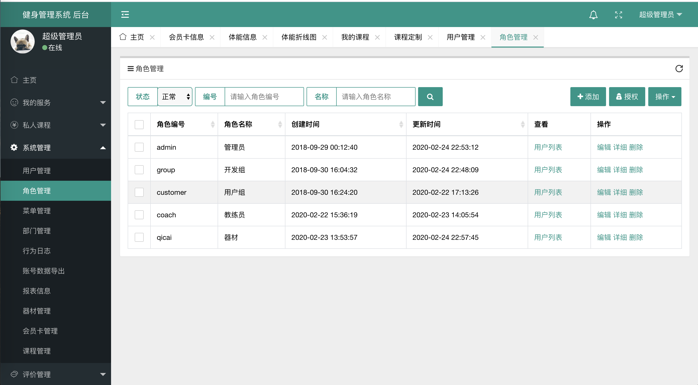

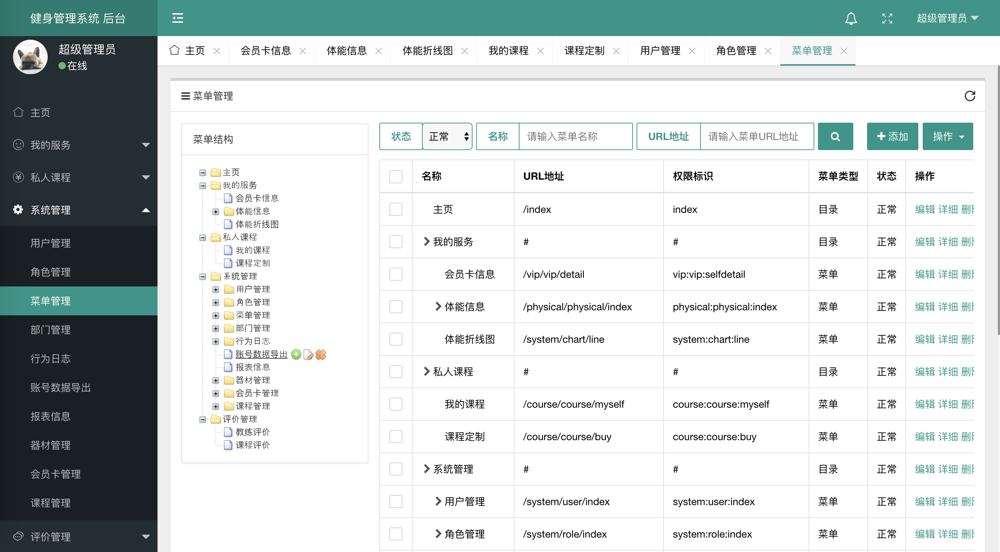

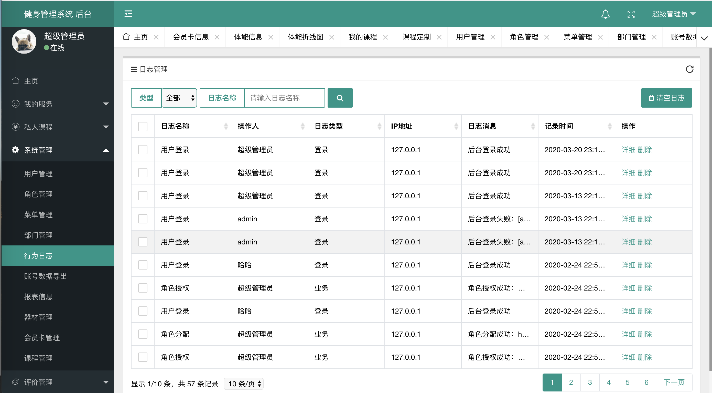

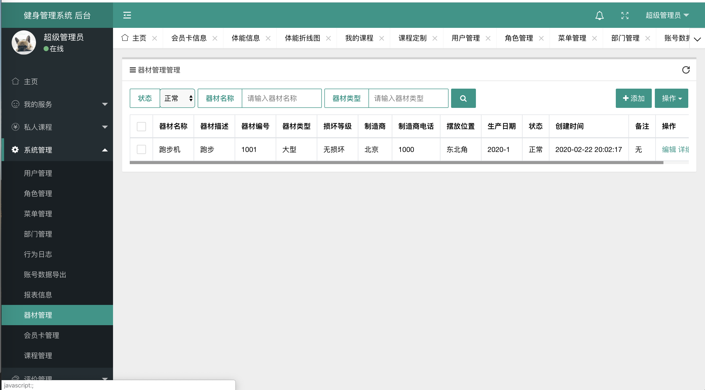

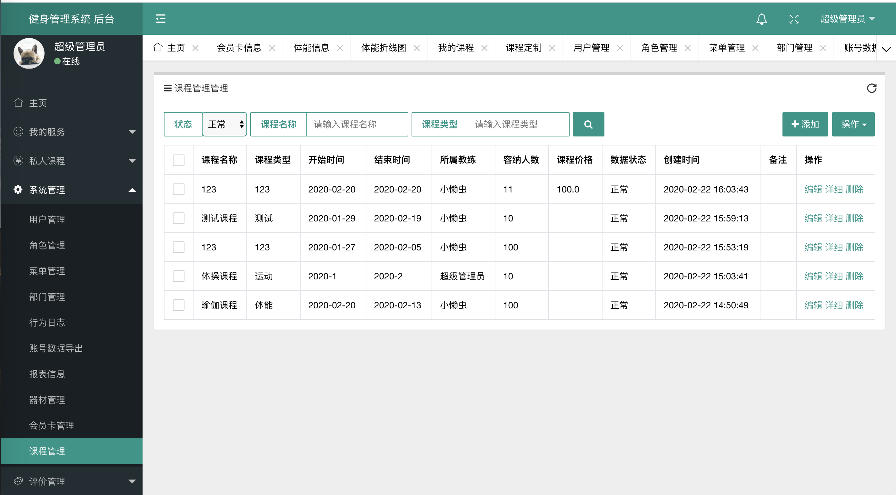

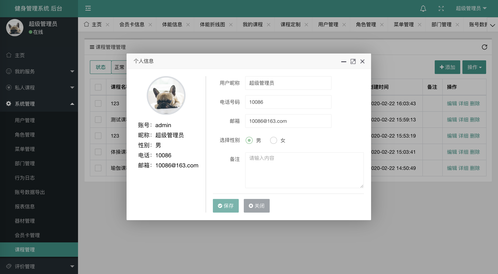

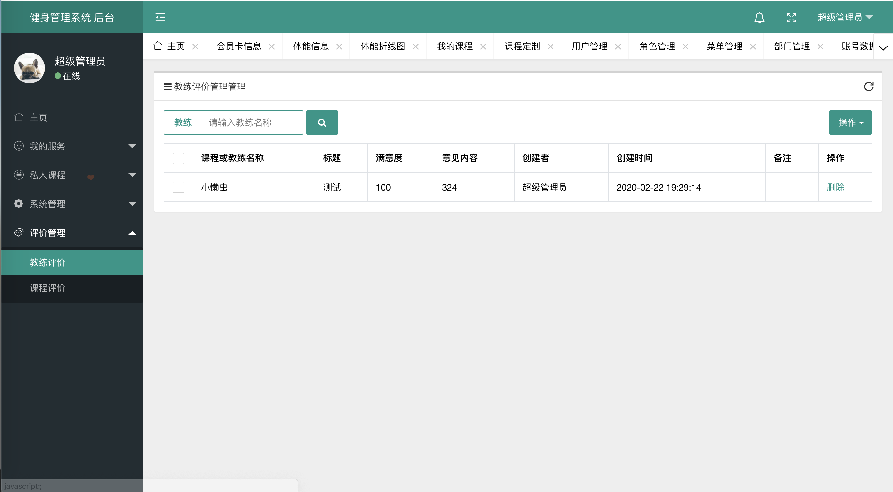

